# **<p align = center> API LIBRARY**

---

## <p align = center>Versão da linguagem de programação deste projeto.

Para a criação deste projeto é necessário possuir o **Python 3.9** ou superior instalado no seu computador para instalar [click aqui](https://www.python.org/downloads/).

Também será necessário o editor de código **Visual Studio Code** que pode ser baixado [clicando aqui](https://code.visualstudio.com/).


---

# <p align = center>**Criando uma  API Django**


Essa api tem a função de cadastro de livros com seus respctivos aspctos(id, titulo, autor, ano de lançamento, estado, páginas, editora e o dia de cadastro ).

Para utilizar o django no projeto iremos criar uma nova pasta que conterá o projeto e dentro desta pasta máquina virtual `venv` para o python.

---

## **Passo 1:** Criando uma máquina virtual `python` para o projeto.

### **O terminal usado foi o `Windows PowerShell`.**

_Observação: Neste exemplo o nome da pasta que será usado é **library_api**._

Dentro da nova pasta criada abra-a no terminal e execute o comando para criar uma máquina virtual venv.

```powershell
    python -m venv  nomedoambientevirtua
```

**Exemplo no Terminal:**

```powershell
   PS C:\Users\Wagne\OneDrive\Documentos\library_api>   python -m venv .venv
```

**Saída na Criação do Ambiente Virtual:**

```powershell
    Não conseguir visualizar a saída no terminal
```

Após o comando dentro da pasta haverá criado uma nova pasta chamada **nomedoambientevirtua**.

```bash
    📦library_api
     ┗ 📁.venv
```

Ativando a máquina virtual:

```powershell
    nomedoambientevirtua\scripts\activate
```

Exemplo no Terminal:

```
    PS C:\Users\Wagne\OneDrive\Documentos\library_api> ...venv\scripts\activate
```

_Saída na Ativação do Ambiente Virtual:_

```
   (.venv) PS C:\Users\Wagne\OneDrive\Documentos\library_api>
```

---

## **Passo 2:** Instalação do framework Django e djangorestframework.

Instalando o Django e  djangorestframework para o projeto.

No terminal digite:

```powershell
    pip install django
```
```powershell
    pip install djangorestframework
```
**Exemplo no Terminal:**

```powershell
   (.venv) PS C:\Users\Wagne\OneDrive\Documentos\library_api>pip install Django

```
```powershell
   (.venv) PS C:\Users\Wagne\OneDrive\Documentos\library_api>pip install djangorestframework

```

**Saída Instalação Django:**

```powershell
   Collecting Django==4.1.7
  Using cached Django-4.1.7-py3-none-any.whl (8.1 MB)
Collecting tzdata
  Using cached tzdata-2022.7-py2.py3-none-any.whl (340 kB)
Collecting sqlparse>=0.2.2
  Using cached sqlparse-0.4.3-py3-none-any.whl (42 kB)
Collecting asgiref<4,>=3.5.2
  Using cached asgiref-3.6.0-py3-none-any.whl (23 kB)
Installing collected packages: tzdata, sqlparse, asgiref, Django
Successfully installed Django-4.1.7 asgiref-3.6.0 sqlparse-0.4.3 tzdata-2022.7

```

**Saída Instalação djangorestframework:**

```powershell
Using cached djangorestframework-3.14.0-py3-none-any.whl (1.1 MB)
Requirement already satisfied: django>=3.0 in c:\users\wagne\onedrive\documentos\library_api\venv\lib\site-packages (from djangorestframework) (4.1.7)
Requirement already satisfied: pytz in c:\users\wagne\onedrive\documentos\library_api\venv\lib\site-packages (from djangorestframework) (2022.7.1)
Requirement already satisfied: tzdata in c:\users\wagne\onedrive\documentos\library_api\venv\lib\site-packages (from django>=3.0->djangorestframework) (2022.7)
Requirement already satisfied: asgiref<4,>=3.5.2 in c:\users\wagne\onedrive\documentos\library_api\venv\lib\site-packages (from django>=3.0->djangorestframework) (3.6.0)
Requirement already satisfied: sqlparse>=0.2.2 in c:\users\wagne\onedrive\documentos\library_api\venv\lib\site-packages (from django>=3.0->djangorestframework) (0.4.3)
Installing collected packages: djangorestframework
Successfully installed djangorestframework-3.14.0
```

para ter um controle do que foi instalado e as versões, crie um requirements.

**Exemplo no Terminal:**
```
C:\Users\Wagne\OneDrive\Documentos\library_api\library> Pip freeze > requirements.txt
```
---

## **Passo 3:** Criando o Projeto Django.

Para iniciar um projeto Django será necessário digitar no terminal o comando:

```powershell
    django-admin startproject nomedoprojeto
```

**Exemplo no Terminal:**

```powershell
   (.venv) PS C:\Users\Wagne\OneDrive\Documentos\library_api>  django-admin startproject library
```

**Saída da Criação Projeto Django**

Na pasta **library_api** será criado uma nova pasta com o nome indicado:

```bash
    📦library_api
     ┣ 📁 library
     ┗ 📁 .venv
```

Abra o pasta library no Visual studio code:
Exemplo

```powershell
   (.venv) PS C:\Users\Wagne\OneDrive\Documentos\library_api> cd .\library\
   (.venv) PS C:\Users\Wagne\OneDrive\Documentos\library_api\library> code .
```

Tela que aparecerá ao iniciar o Visual Studio code:

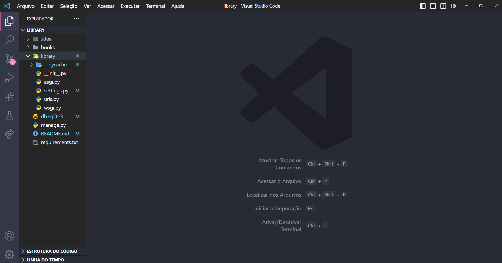

---

## **Passo 4:** Configurando o Python no Visual Studio code.

Aperte a tecla F1 do teclado e procure “Selecionar Interpretador” e clique nele.

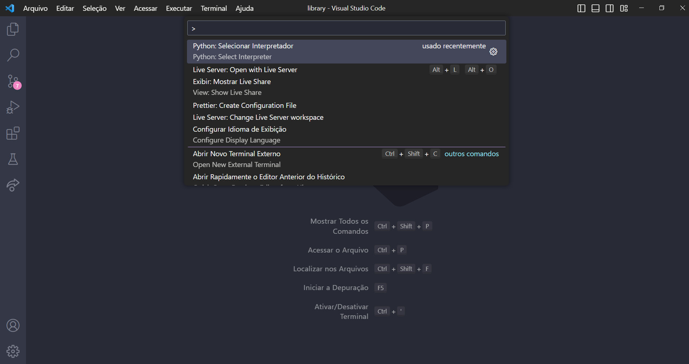

Selecione o python da pasta .venv do projeto e ative ele como interpretador.

---

## **Passo 5:** Testando ssr o Django Esta Funcionando.

No terminal verifique se está na pasta library, se sim digite o comando para executar o projeto:

```powershell
   python manage.py runserver
```

**Exemplo no Terminal:**

```powershell
   (.venv) PS C:\Users\Wagne\OneDrive\Documentos\library_api\library> python manage.py runserver
```

No terminal aparecerá o ip no qual está sendo executado exemplo: http://127.0.0.1:8000/
Ao clicar nesta tela será direcionado para a página inicial de um projeto django.

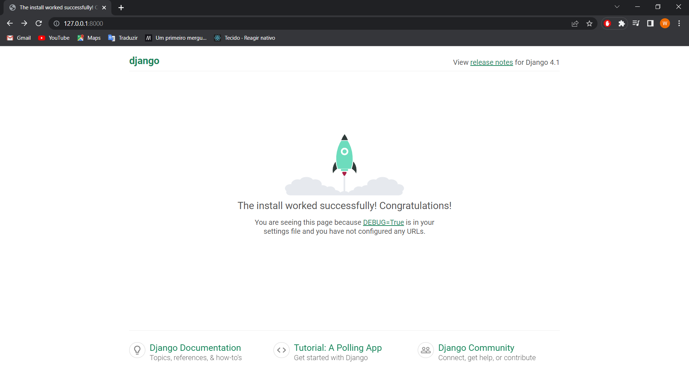

Na saída do terminal apareceu que:

```
<code style="color:red">
    You have 18 unapplied migration(s). Your project may not work properly until you apply the migrations for app(s): admin, auth, contenttypes, sessions.
    Run 'python manage.py migrate' to apply them.
    March 08, 2023 - 14:56:55
    Django version 4.1.7, using settings 'library.settings'
    Starting development server at http://127.0.0.1:8000/
</code>

```
Para parar a execução CTRL - C ou CTRL-BREAK, ser não tiver o BREAK no seu teclado execute FN-CTRL-B

---

## **Passo 6:** Migrando os apps padrões.

Para efetuar as migrações, no terminal digite o comando:

```powershell
  python manage.py migrate
```

**Exemplo no Terminal:**

```powershell
  (.venv) PS C:\Users\Wagne\OneDrive\Documentos\library_api\library> python manage.py migrate
```

**Saída da Migração dos Apps Padrões:**

```powershell
  Operations to perform:
  Apply all migrations: admin, auth, contenttypes, sessions
Running migrations:
  Applying contenttypes.0001_initial... OK
  Applying auth.0001_initial... OK
  Applying admin.0001_initial... OK
  Applying admin.0002_logentry_remove_auto_add... OK
  Applying admin.0003_logentry_add_action_flag_choices... OK
  Applying contenttypes.0002_remove_content_type_name... OK
  Applying auth.0002_alter_permission_name_max_length... OK
  Applying auth.0003_alter_user_email_max_length... OK
  Applying auth.0004_alter_user_username_opts... OK
  Applying auth.0005_alter_user_last_login_null... OK
  Applying auth.0006_require_contenttypes_0002... OK
  Applying auth.0007_alter_validators_add_error_messages... OK
  Applying auth.0008_alter_user_username_max_length... OK
  Applying auth.0009_alter_user_last_name_max_length... OK
  Applying auth.0010_alter_group_name_max_length... OK
  Applying auth.0011_update_proxy_permissions... OK
  Applying auth.0012_alter_user_first_name_max_length... OK
  Applying sessions.0001_initial... OK
```

---

## **Passo 7:** Criando um novo app.

Nesse passo vamos criar um novo app para o projeto chamado books. Para isso no terminal vamos digitar o comando:

```powershell
   python manage.py startapp nomedoapp
```

**Exemplo no Terminal:**

```powershell
   (.venv) PS C:\Users\Wagne\OneDrive\Documentos\library_api\library> python manage.py startapp books
```

Na pasta **library** será criado uma nova pasta com o nome indicado:

```bash
     📁 library
     ┗ 📁 books
          ┣ 📁 migrations
          ┣ 📜 __init__.py
          ┣ 📜 admin.py
          ┣ 📜 app.py
          ┣ 📜 models.py
          ┣ 📜 tests.py
          ┗ 📜 views.py
```

---

## **Passo 8:** Criação do modelo de tabela para o banco de dados.

No visual studio code abra a pasta books e abra para editar o arquivo **models.py**
Neste arquivo vamos criar uma classe Books, que definirá os campos da tabela que armazenará os posts no banco de dados.
Digite o seguinte código para a criação desta classe:

```python
from django.db import models
from uuid import uuid4


# Create your models here.

class Books(models.Model):
    id_book = models.UUIDField(primary_key=True, default=uuid4, editable=False)  # id do livro
    title = models.CharField(max_length=255)  # título do livro
    author = models.CharField(max_length=255)  # autor
    release_year = models.IntegerField()  # ano de lamçamento
    state = models.CharField(max_length=50)  # estado do livro
    pages = models.IntegerField()  # quantidade de paginas
    create_at = models.DateField(auto_now_add=True)  # o dia de criação na base de dados
    publishing_conpany = models.CharField(max_length=255)  # editora
```

Após ter adicionado essa classe vá na pasta **library/library** e selecione o arquivo settings.py

```bash
     📁 library
     ┣ 📁 books
     ┗ 📁 library
        ┗ 📜 settings.py
```

Na linha 42 e 43 em **INSTALLED_APPS** adicione o books e rest_framework: ‘rest_framework’, ‘books’, :

```python
INSTALLED_APPS = [
    'django.contrib.admin',
    'django.contrib.auth',
    'django.contrib.contenttypes',
    'django.contrib.sessions',
    'django.contrib.messages',
    'django.contrib.staticfiles',
    'rest_framework',# Adicione o rest_framework
    'books', # Adicione o books
]
```

Criando o arquivo de migrate, no terminal digite o comando:

```powershell
  python manage.py makemigrations books
```

**Exemplo no Terminal:**

```powershell
   (.venv) PS C:\Users\Wagne\OneDrive\Documentos\library_api\library> python manage.py makemigrations books
```

**Saída da Criação do Arquivo Migrate:**

```powershell
Migrations for 'books':
  books\migrations\0001_initial.py
    - Create model Post
```

---

## **Passo 9:** Migração do books para o sql.

No terminal digite o comando para migrar o books:

```powershell
   python manage.py sqlmigrate books 0001
```

**Exemplo no Terminal:**

```powershell
   (.venv) PS C:\Users\Wagne\OneDrive\Documentos\library_api\library> python manage.py sqlmigrate books 0001
```

**Saída da Migração do books**

```powershell
BEGIN;
--
-- Create model Books
--
CREATE TABLE "books_books" ("id_book" char(32) NOT NULL PRIMARY KEY, "title" varchar(255) NOT NULL, "author" varchar(255) NOT NULL, "release_year" integer NOT NULL, "state" varchar(50) NOT NULL, "pages" integer NOT NULL, "create_at" date NOT NULL, "publishing_conpany" varchar(255) NOT NULL);
COMMIT;
```

Aplicando o migrate digite o comando:

```powershell
  python manage.py migrate books
```

**Exemplo no Terminal:**

```powershell
   (.venv) PS C:\Users\Wagne\OneDrive\Documentos\library_api\library> python manage.py migrate books
```

**Saída da Aplicação do Migrate**

```powershell
Operations to perform:
  Apply all migrations: books
Running migrations:
  Applying books.0001_initial... OK
```

A tabela foi criada no banco de dados.

## **Passo 10:** Criando pasta `api` com arquivos `serializers.py` e `viewsets.py`.

Entre na pasta `books` e crie uma pasta `api`, dentro da pasta `api` crie os arquivos `serializers.py` e `viewsets.py`:

📁 library
 ┣ 📁 books
    ┣ 📁 api
       ┣ 📜 serializers.py
       ┗ 📜 viewsets.py

Vá ate o arquivo `books\api\serializers.py` nele escreva o seguinte código:

```python
from rest_framework import serializers
from books import models


class BooksSerializer(serializers.ModelSerializer):
    class Meta:
        model = models.Books
        fields = '__all__'
```
Agora vá ate o arquivo `books\api\viewsets.py` nele escreva o seguinte código: 

```python
rom rest_framework import viewsets
from books.api import serializers
from books import models


class BooksViewSet(viewsets.ModelViewSet):
    serializer_class = serializers.BooksSerializer
    queryset = models.Books.objects.all()
```

---

## **Passo 11:** Criação de Rotas do Projeto.

Agora tenos que cria nossas rotas, vá ate o `library\library\ urls.py`.

```bash
  📁 library
  ┗ 📁 library
     ┗ 📜 urls.py
```
Agora vamos alterar o arquivo `urls.py` dentro da pasta `library`, então temos que: `library\library\urls.py`, o codigo deste arquivo ficará:

```python
from django.contrib import admin
from django.urls import path, include

from rest_framework import routers

from books.api import viewsets as booksviewsets

route = routers.DefaultRouter()

route.register(r'books', booksviewsets.BooksViewSet, basename="Books")

urlpatterns = [
    path('admin/', admin.site.urls),
    path('', include(route.urls))
]
urlpatterns += route.urls
```

## **Passo 12:** Testando Projeto API Library.

No terminal verifique se está na pasta library, se sim digite o comando para executar o projeto:

```powershell
   python manage.py runserver
```

**Exemplo no Terminal:**

```powershell
   (.venv) PS C:\Users\Wagne\OneDrive\Documentos\library_api\library> python manage.py runserver
```

No terminal aparecerá o ip no qual está sendo executado exemplo: http://127.0.0.1:8000/
Ao clicar nesta tela será direcionado para a página inicial de um projeto api library.

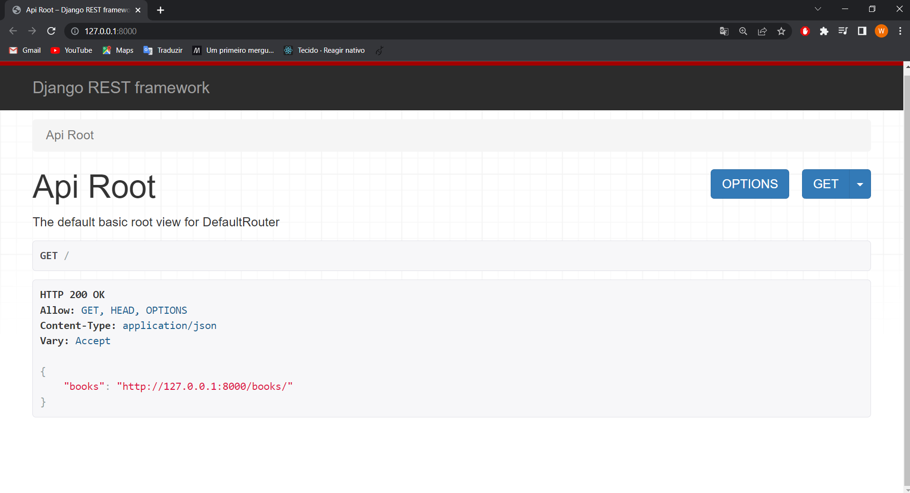 

Clicando no link será direcionado para a Books List, onde vc consiguira publicar os livros no banco de dados.

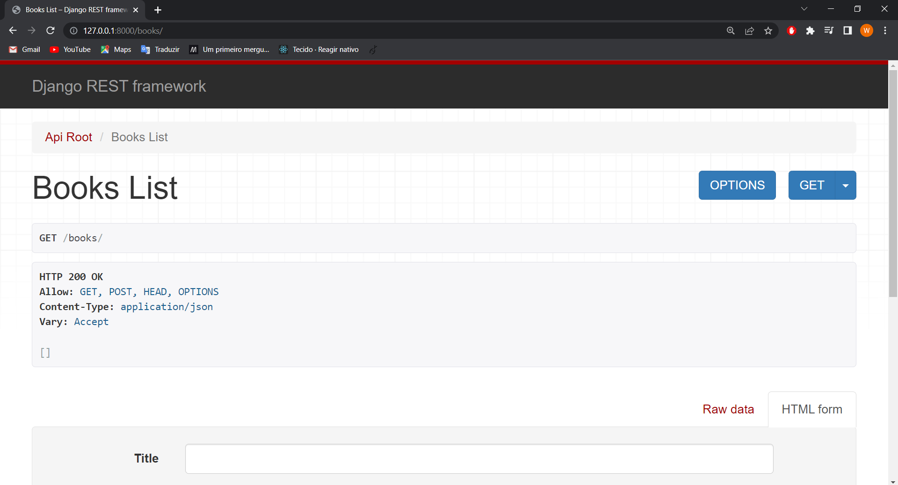

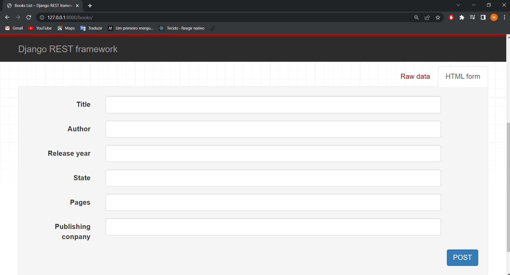


## **Passo 13:** Como fazer o deploy da sua aplicação Django API Library.

Para o deploy dessa aplicação foi utilizado o [pythonanywhere](https://www.pythonanywhere.com/).

Crie uma conta no pythonanywhere e a acesse.

**Como funciona:**

Implantar um projeto Django no PythonAnywhere é muito parecido com executar um projeto Django em seu próprio PC. Você usará um virtualenv, assim como provavelmente faz em seu próprio PC, você terá uma cópia do seu código no PythonAnywhere que poderá editar, navegar e confirmar no controle de versão.

A principal diferença é que, em vez de usar o servidor Django dev `manage.py runservere` visualizar seu site no localhost, você criará o que chamamos de aplicativo Web por meio da guia Web em nossa interface do usuário e, em seguida, configurará com um arquivo WSGI cujo trabalho é simplesmente importar seu projeto Django.

**Passo 1: Fazendo upload do seu código para o PythonAnywhere**

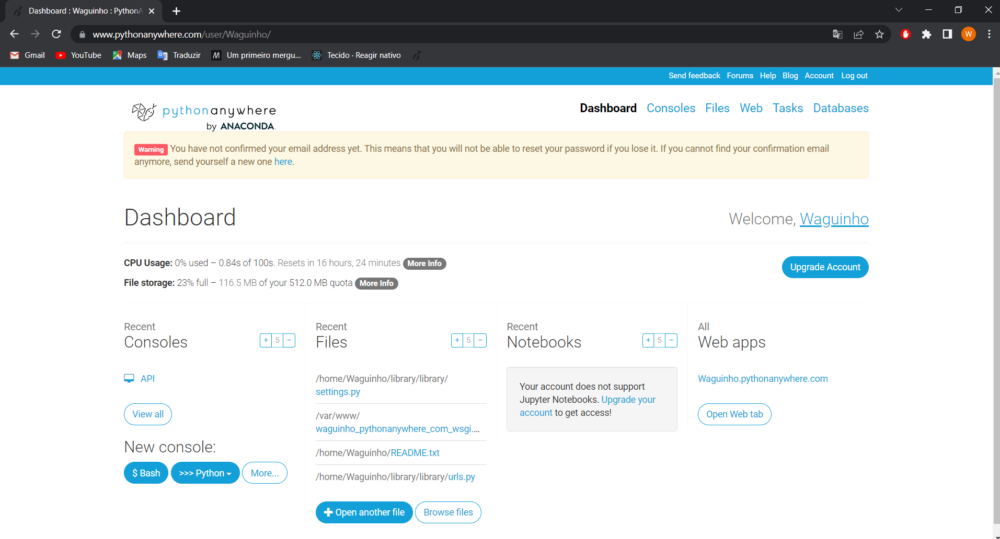

Vá ate consoles e click em bash, ao clica vai ser criado um novo console.

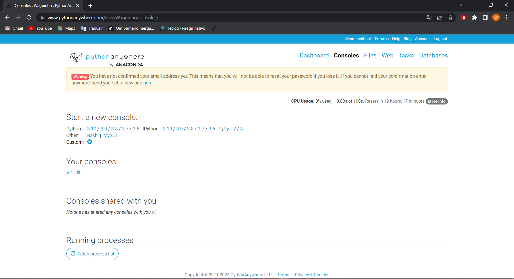

Supondo que seu código já esteja em um site de compartilhamento de código como GitHub ou Bitbucket, você pode simplesmente cloná-lo em um Bash Console :

```
# exemplo
$ git clone https://github.com/myusername/myproject.git

```
**Passo 2: Crie um virtualenv e instale o Django e quaisquer outros requisitos**

No seu console Bash, crie um virtualenv, nomeando-o com o nome do seu projeto e escolhendo a versão do Python que deseja usar:

```
# exemplo
$ mkvirtualenv --python = /usr/bin/python3.10 mysite-virtualenv
```
e reinstale tudo que foi instalado na criação do projeto a cima.


```
# exemplo
$ ( mysite-virtualenv ) $ pip install django
 # ou, se você tiver um requirements.txt: 
$ ( mysite-virtualenv ) $ pip install -r requirements.txt
 # estalando o requirements tudo que instalou no projeto a cima sera instalado no console do pythonanywhere.
```
**Aviso :** Django pode demorar muito para instalar. O PythonAnywhere tem internet muito rápida, mas o acesso ao sistema de arquivos pode ser lento, e o Django cria muitos arquivos pequenos durante sua instalação. Felizmente, você só precisa fazer isso uma vez

**Passo 3: Configurando seu aplicativo Web e arquivo WSGI**

Neste ponto, você precisa estar armado com 3 informações:

1. O caminho para a pasta principal do seu projeto Django -- a pasta que contém "manage.py", por exemplo, /home/myusername/mysite
2. O nome do seu projeto (esse é o nome da pasta que contém seu settings.py), por exemplo, meusite
3. O nome do seu virtualenv, por exemplo mysite-virtualenv

**Criar um aplicativo Web com configuração manual**

Vá para a guia Web e crie um novo aplicativo da web, escolhendo a opção "Configuração manual" e a versão correta do Python (a mesma que você usou para criar seu virtualenv).

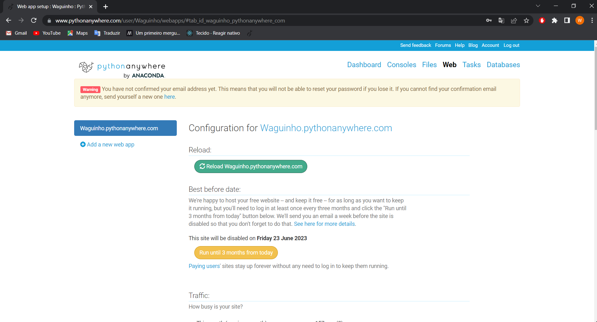

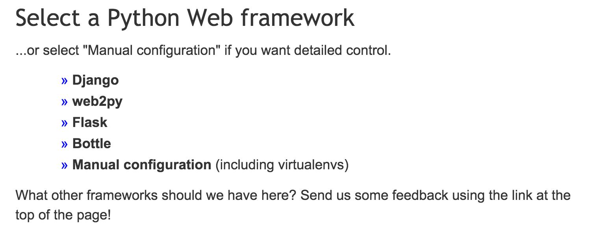

NOTA: Certifique-se de escolher Manual Configuration , não a opção "Django", que é apenas para novos projetos.

**Digite seu nome virtualenv**

Feito isso, digite o nome do seu virtualenv na seção Virtualenv na guia web e clique em OK.

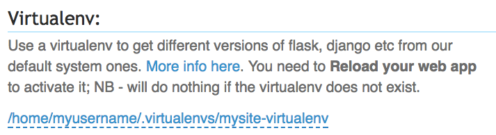

Você pode apenas usar seu nome curto "mysite-virtualenv" e ele será automaticamente concluído em seu caminho completo em /home/username/.virtualenvs.

**Opcional: insira o caminho para o seu código**

Embora isso não seja necessário para o funcionamento do aplicativo, você pode, opcionalmente, definir seu diretório de trabalho e fornecer a si mesmo um hiperlink conveniente para seus arquivos de origem na guia da web.

Digite o caminho para a pasta do seu projeto na seção Código na guia da Web, por exemplo, /home/myusername/mysite em Código-fonte e Diretório de trabalho

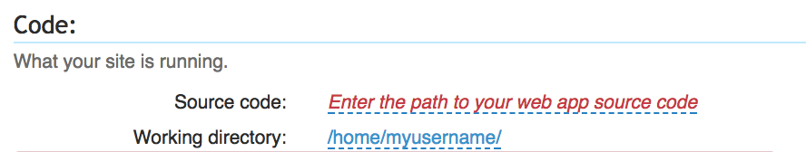

**Edite seu arquivo WSGI**

Uma coisa importante aqui: seu projeto Django (se você estiver usando uma versão recente do Django) terá um arquivo dentro dele chamado `wsgi.py`. Este não é o que você precisa alterar para configurar as coisas no PythonAnywhere - o sistema aqui ignora esse arquivo.

Em vez disso, o arquivo WSGI a ser alterado é aquele que possui um link dentro da seção "Código" da guia Web - ele terá um nome como `/var/www/yourusername_pythonanywhere_com_wsgi.py` ou `/var/www/www_yourdomain_com_wsgi.py`.

Clique no link do arquivo WSGI e ele o levará a um editor onde você poderá alterá-lo.

Exclua tudo, exceto a seção Django e, em seguida, descomente essa seção. Seu arquivo WSGI deve se parecer com isto:

```
# +++++++++++ DJANGO +++++++++++ 
# Para usar seu próprio aplicativo Django, use um código como este: 
import  os 
import  sys

# supondo que seu arquivo de configurações do Django esteja em '/home/myusername/mysite/mysite/settings.py' 
path  =  '/home/myusername/mysite' 
if  path  not  in  sys . caminho : 
    sys . caminho . inserir ( 0 ,  caminho )

os . environ [ 'DJANGO_SETTINGS_MODULE' ]  =  'mysite.settings'

## Descomente as linhas abaixo dependendo da sua versão do Django 
###### então, para Django >=1.5: 
from  django.core.wsgi  import  get_wsgi_application 
application  =  get_wsgi_application () 
###### ou, para Django mais antigo < =1.4 
#import django.core.handlers.wsgi 
#application = django.core.handlers.wsgi.WSGIHandler()

```
1 .Certifique-se de substituir o caminho correto para o seu projeto, a pasta que contém manage.py, que você anotou acima.
2. Não se esqueça de substituir seu próprio nome de usuário também!
3. Certifique-se também de colocar o valor correto para DJANGO_SETTINGS_MODULE.
3. Este guia assume que você está usando uma versão recente do Django, então deixe o wsgi.WSGIHandler()código antigo como comentário ou, melhor ainda, exclua-o.
Salve o arquivo e clique no botão Recarregar para o seu domínio. (Você encontrará um no canto superior direito do editor de arquivos wsgi ou pode voltar para a guia principal da web)

**Passo 4: Configuração do banco de dados**

Se, como a maioria dos sites, seu site usa um banco de dados, você precisará configurá-lo. Vá para a guia Consoles , inicie seu console bash, use `cd` para navegar até o diretório onde está o seu projeto Django e `manage.py`, em seguida, execute

```
$ python manage.py migrate
```
e confirar ser aconteceu a migração com sucesso.

**Passo 5: Testa o retorno da api**

Vá para a guia Web click ou copie e cole o primeiro link que aparece, ele vai ser o link do seu projeto online na rede.
Dentro desse link vai ter outro link com o retorno dos dados do projeto.


Para testa o retorno do link da api irei usa o [Insomnia](https://insomnia.rest/download), você pode usa outras opções.

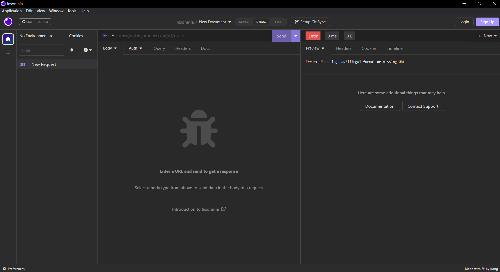

Entre no insomnia e cole o link e click em send e espere o retordo da aplicação.

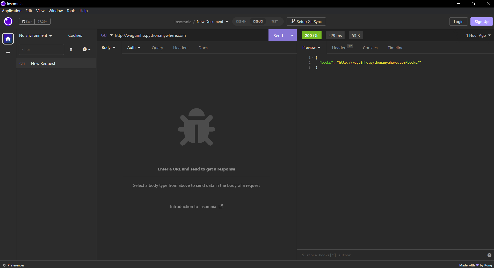

Faça o mesmo proceço com o link retornado.

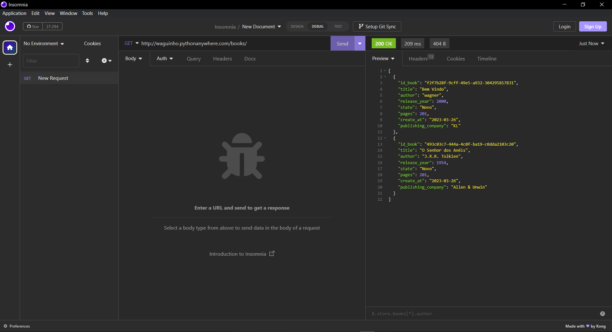

É chegamos ao fim de mais uma aplicação, ate uma outra.

---
